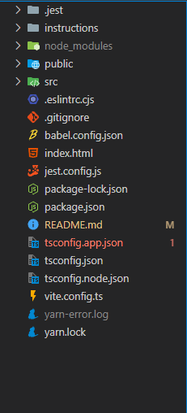
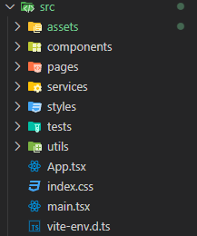

# Password Validation

O objetivo é criar uma simples página que resolva um desafio de senhas descrito abaixo e que seja possível o usuário enviar uma senha através de um formulário com nome e email para uma REST API pré-determinada.

## O desafio

Você é um especialista em segurança tentando quebrar o sistema de uma empresa que o pagou para tal. Investigando falhas na segurança você descobriu que senhas válidas devem seguir um certo padrão:

Senhas são números com 6 dígitos.
A senha deve estar entre 184759-856920.
Dois dígitos adjacentes devem ser iguais (como 22 em 122346)
Começando da esquerda para a direita, os dígitos devem apenas crescer em valor ou se manter (como 111237 ou 135678).
Exemplos:

222222 é válido (tem o dígito 2 repetido adjacente e nunca diminui em valor)
236775 não é válido (diminui o valor dos dígitos no trecho 75)
135789 não é válido (não há duplicação de dígitos adjacentes)
Sua aplicação deve validar se uma senha fornecida pelo usuário é válida e caso seja, só assim poderá submeter o formulário. Caso inválida, informe o usuário quais regras foram violadas.

## 🛠️ Construído com

Seguindo os requisitos do projeto, essas foram as tecnologias usadas:

- TypeScript - Linguagem utilizada
- Vite - Utilizei Vite por motivos de ambiente de desenvolvimento mais veloz e eficiente, menos robusto para um projeto menor.
- ReactJs - Framework utilizado (com Vite)
- Jest e React Testing Library - Frameworks utilizados para a criação dos testes unitários automatizados
- Scss - Pré Compilador CSS

### 🔧 Instalação

Primeiro, você deve clonar esse repositório na sua máquina. Com o repositório clonado, abra-o no terminal e instale as dependências

```
yarn ou npm install
```

Após a instação das dependências, estamos prontos para rodar o projeto localmente:

```
yarn dev ou npm run dev
```

## ⚙️ Executando os testes

Para rodar os testes unitários, basta rodar o seguinte código no terminal:

```
yarn test ou npm run test
```

## 🏗️ Arquitetura da aplicação

### Estrutura das pastas



- Na raiz do projeto, apenas algumas pastas e arquivos de configuração.
- Na pasta instructions, todas as diretrizes, regras e instruções para o desafio.
- Na pasta public, apenas a logo usada para o favicon
- Pasta src, onde está toda a estrutura do projeto:

#### Pasta src



- assets: onde armazeno as imagens usadas no projeto
- components: estão os nossos componentes, trechos de código que são renderizados dentro das páginas
- pages: os arquivos das páginas
- services: na pasta services, costumo criar os arquivos onde ficarão nossas requisições de APIs
- styles: nossas variáveis e mixins para utilizarmos na estilização dos nossos componentes e páginas
- tests: os arquivos de testes automatizados
- utils: na pasta utils, gosto de armazenar funções maiores, que vão depender de muitas linhas de código e serão chamadas eventualmente mais de uma vez no nosso sistema.
